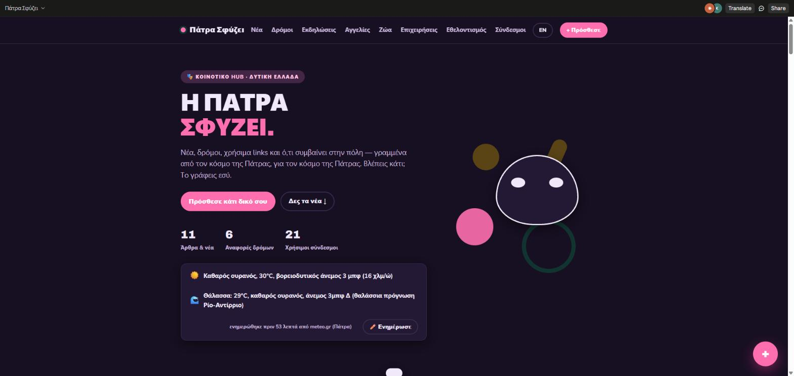
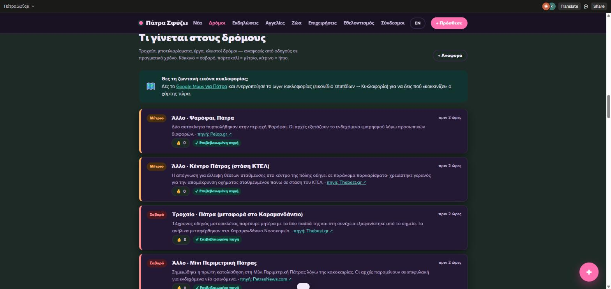
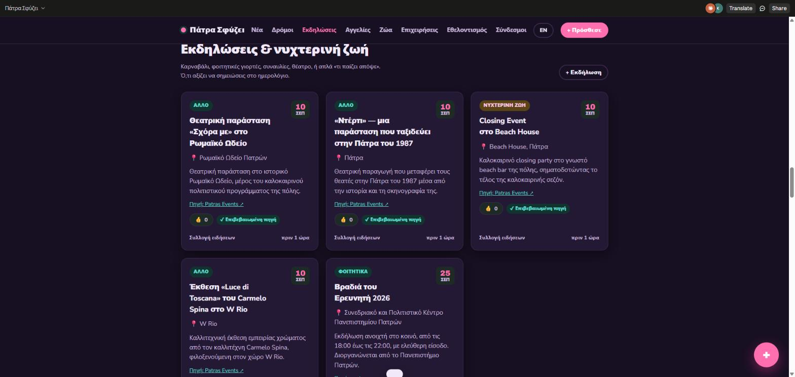
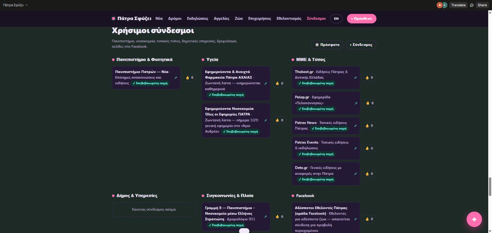

# Πάτρα Σφύζει 🎭

**A community hub for the city of Patras, Greece** — local news, live road reports, events, classifieds, lost & found pets, a local business directory, volunteering, and useful links, all open for anyone to contribute to.

## Τι είναι αυτό

Το **Πάτρα Σφύζει** είναι ένα κοινοτικό site για την Πάτρα και τη Δυτική Ελλάδα, φτιαγμένο με έμφαση σε ένα νεανικό, ζωντανό visual identity εμπνευσμένο από το Πατρινό Καρναβάλι. Κάθε ενότητα είναι ανοιχτή σε όλους να προσθέσουν περιεχόμενο — δεν υπάρχει "αρχισυντάκτης".

### Ενότητες

- **Νέα** — άρθρα, απόψεις, ανακοινώσεις από κατοίκους, με προαιρετική αναφορά πηγής όταν κάποιος μοιράζεται κάτι από αλλού
- **Δρόμοι** — αναφορές κυκλοφορίας/τροχαίων σε πραγματικό χρόνο, με χρωματική κωδικοποίηση σοβαρότητας
- **Εκδηλώσεις & νυχτερινή ζωή** — από καρναβάλι μέχρι φοιτητικές γιορτές και συναυλίες
- **Αγγελίες** — ενοικιάσεις, πωλήσεις, ζητούνται/προσφέρονται
- **Χαμένα & βρεθέντα ζώα**
- **Τοπικές επιχειρήσεις** — απλός κατάλογος με διεύθυνση, όχι διαδραστικός χάρτης
- **Εθελοντισμός & τοπικές δράσεις**
- **Χρήσιμοι σύνδεσμοι** — Πανεπιστήμιο, εφημερεύοντα νοσοκομεία/φαρμακεία, τοπικός τύπος, συγκοινωνίες, Δήμος

Κάθε αντικείμενο μπορεί να πάρει 👍, οι επίσημες/επιβεβαιωμένες πηγές έχουν σήμα ✔, και υπάρχει EN/ΕΛ toggle για το βασικό μενού.

## Screenshots

| Αρχική | Δρόμοι |
|---|---|
|  |  |

| Εκδηλώσεις | Χρήσιμοι σύνδεσμοι |
|---|---|
|  |  |

## Τεχνολογία

Ένα ενιαίο, framework-free `index.html` — καθαρό HTML/CSS/vanilla JavaScript, χωρίς build step. Τα γραμματοσειρές έρχονται από Google Fonts (Archivo + Nunito Sans).

Όλο το περιεχόμενο (άρθρα, αναφορές, likes, κ.λπ.) αποθηκεύεται και συγχρονίζεται σε πραγματικό χρόνο μέσω ενός realtime document store, στο οποίο η σελίδα συνδέεται κατά το load (βλ. `claude.use("db")` στο `<script>`). Αυτό σημαίνει ότι αν ανοίξεις το `index.html` απευθείας σε browser ή το φιλοξενήσεις σε ένα απλό static host (π.χ. GitHub Pages) **χωρίς αντίστοιχο backend**, η σελίδα θα φορτώσει κανονικά αλλά οι ενότητες θα εμφανιστούν άδειες και οι φόρμες δεν θα μπορούν να στείλουν δεδομένα — το UI/UX είναι πλήρες, το data layer χρειάζεται δικό του backend για να λειτουργήσει ανεξάρτητα.

## Σχεδιαστικές επιλογές

- Παλέτα εμπνευσμένη από το καρναβάλι (μαγέντα, χρυσό, βαθύ μοβ) πάνω σε φόντο θαλασσί-λευκό
- Πλήρης υποστήριξη dark/light theme μέσω `prefers-color-scheme`
- Responsive grid layout, καμία εξάρτηση από κάποιο CSS framework
- Προσβασιμότητα: focus states, `aria` attributes στο modal, σεβασμός στο `prefers-reduced-motion`

## Roadmap

- [ ] Πλήρης μετάφραση περιεχομένου (όχι μόνο το μενού)
- [ ] Πραγματικός λογαριασμός/σύνδεση χρήστη αντί για ανώνυμες αναρτήσεις
- [ ] Push notifications
- [ ] Backend υλοποίηση ανεξάρτητη από το τρέχον data layer, ώστε να τρέχει αυτόνομα
